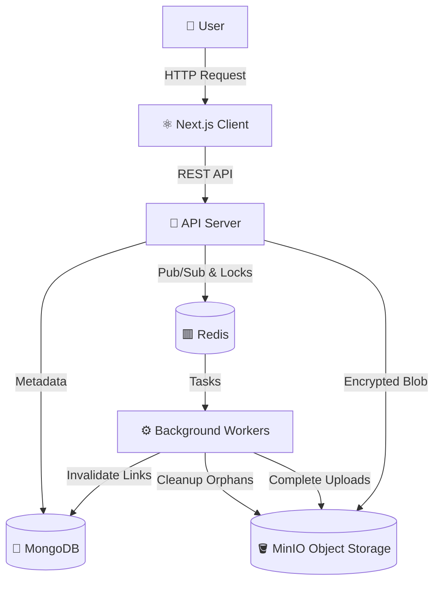

# FileX 🔐

**FileX** is a privacy-first file infrastructure system engineered for secure and encrypted file exchange 🛡️.

Designed with privacy and security at its core 🔒, FileX ensures that every file transfer and storage operation is protected through strong end-to-end encryption 🔐 and controlled, secure transfer mechanisms ⚙️. Whether you're sharing sensitive documents 📁, distributing internal assets 🏢, or building secure workflows 🔄, FileX keeps your data protected at every stage 🚀.

At its core, FileX represents **File Infrastructure for Locked Encrypted eXchange** 🔏 — where security is not an add-on, but the foundation 🧱.

## 🚀 Why FileX?

We built FileX on the principle of **Zero-Compromise Security**.

- **Privacy First 🛡️**: Files are encrypted, and access is tightly controlled. 
- **Scale Seamlessly 📈**: Built to handle massive files seamlessly using multipart uploads and S3-compatible object storage.
- **Automated Lifecycle ⏳**: Auto-expiring links and automated garbage collection ensure no orphaned data is left behind.
- **High Performance ⚡**: Powered with a Go backend and a Next.js App Router frontend for blazing-fast experiences.
- **Engineering Excellence 🛠️**: Utilizing background workers (Redis + Go) to handle the heavy lifting off the main API thread.

## ✨ Features

### 🔐 Uncompromising Security
- **End-to-End Encryption Support**: Files can be encrypted before storage using secure wrapper keys.
- **Secure File Exchange**: Generates unique, secure access links for shared files.
- **Privacy-focused**: Complete peace of mind knowing unauthorized users can't access your sensitive files.

### 📦 Robust File Handling
- **Multipart Uploads**: Efficiently handles huge files by chunking them into smaller parts for reliable transfer and zero timeouts.
- **Seamless Downloads**: High-speed, secure file retrieval directly to your device.

### ⚙️ Automated Data Management
- **Link Expiry**: Automatically invalidate access to files after a set Time-to-Live (TTL).
- **Garbage Collection**: Background jobs safely clean up orphaned or incomplete payloads to save storage.
- **Background Processing**: Dedicated worker containers process expiry, gc, and multipart assemblies asynchronously.

### 🎨 Modern & Fast UI
- **Next.js 16 App Router**: Leverage the latest React server components for fast rendering and optimal UX.
- **Interactive Visuals**: WebGL-powered particle effects using OGL.

## 🛠️ The Tech Stack

FileX isn't just a file host; it's an architectural showcase of modern Go and Next.js built for security and scale.

### **Frontend** (The Interface) 🎨
- **Next.js 16**: React framework with App Router for server-side rendering and static generation.
- **React 19**: Utilizing the latest concurrent features.
- **Tailwind CSS v4**: Utility-first CSS framework for rapid styling.
- **OGL**: Ultra-lightweight WebGL library for dynamic UI elements.
- **Lucide React**: Beautiful, consistent icon set.

### **Backend** (The Engine) 🦍
- **Go 1.26**: Raw performance and robust concurrency for API handling.
- **MongoDB**: Primary database for file metadata, settings, and transaction tracking.
- **Redis**: Fast, in-memory datastore for rate limiting, caching, and task queues.
- **MinIO**: High-performance, S3-compatible object storage for securely preserving actual file data.
- **Dedicated Workers**: Separate Go micro-services for Expiry, Multipart jobs, and Garbage Collection.

### **Infrastructure** 🏗️
- **Docker & Docker Compose**: Fully containerized setup for reproducible development and production environments.

## ⚡ Quick Start

Want to see it in action? You only need [Docker](https://www.docker.com/).

```bash
# Clone the repository
git clone https://github.com/pranavdhawale/bytefile.git
cd bytefile

# Start development environment 🚀
docker-compose -f docker-compose.dev.yml up --build -d
```

That's it! Everything boots up automatically.

- 🎨 **Frontend**: [http://localhost:3000](http://localhost:3000)
- ⚙️ **Backend API**: [http://localhost:8080](http://localhost:8080)
- 🪣 **MinIO Console**: [http://localhost:9001](http://localhost:9001)

## 🏗️ Architecture

FileX follows a robust **Micro-Services & Worker** architecture for responsive, scalable file operations.



### Key Components

- **Client**: Next.js SPA/SSR application handling layout, cryptography (if client-side), and UX.
- **API Server**: Central Go server handling request validation, routing, and access control.
- **MinIO Storage**: Stores the encrypted file blobs securely.
- **Background Workers**: 
  - `worker-expiry`: Actively reaps expired shares.
  - `worker-multipart`: Constructs multipart chunks into a single file object.
  - `worker-gc`: Identifies and removes orphaned chunks or failed multi-part uploads.

## 📁 Project Structure

```
bytefile/
├── client/                 # Next.js 16 Front-End
│   ├── app/                # App Router pages and layouts
│   ├── components/         # Reusable UI components
│   ├── lib/                # Client utilities
│   ├── public/             # Static assets
│   └── types/              # TypeScript definitions
│
├── server/                 # Go 1.26 Backend
│   ├── cmd/                # Entrypoints for API and workers
│   ├── internal/           # Core application logic
│   │   ├── api/            # HTTP handlers & routes
│   │   ├── crypto/         # Encryption mechanics
│   │   ├── database/       # DB connection & models
│   │   ├── storage/        # MinIO S3 operations
│   │   └── workers/        # Background queue processors
│   └── Dockerfile          # Multi-stage Go builder
│
└── docker-compose.dev.yml  # Local dev orchestration
```

## 👩💻 Development

We use a modern dockerized workflow to spin up all moving parts smoothly and reliably.

### Commands

```bash
# Start development environment
docker-compose -f docker-compose.dev.yml up

# Rebuild containers
docker-compose -f docker-compose.dev.yml up --build

# Stop all services
docker-compose -f docker-compose.dev.yml down

# View logs
docker-compose -f docker-compose.dev.yml logs -f

# View specific service logs
docker-compose -f docker-compose.dev.yml logs -f api
docker-compose -f docker-compose.dev.yml logs -f worker-gc
```

## 🔒 Privacy & Data

- **Encrypted at Rest**: Files are secured cryptographically.
- **Ephemeral Access**: Expiry limits mean your files never sit available forever.
- **Self-Hosted Complete Control**: Keeps data in your hands entirely.
- **No Tracking**: Your transfers are your business alone. We don't track your behavior.
- **Open Source**: Full transparency in what code runs on your hardware.

## 🤝 Contributing

We ❤️ open source! If you have ideas, suggestions, or bug fixes, feel free to contribute.

1. Fork the repo 🍴
2. Create your feature branch (`git checkout -b feature/AmazingFeature`)
3. Commit your changes (`git commit -m 'Add some AmazingFeature'`)
4. Push to the branch (`git push origin feature/AmazingFeature`)
5. Open a Pull Request 📩

## 📝 License

This project is licensed under the MIT License - see the [LICENSE](LICENSE) file for details.

---

**Built with ❤️ for the community.**
